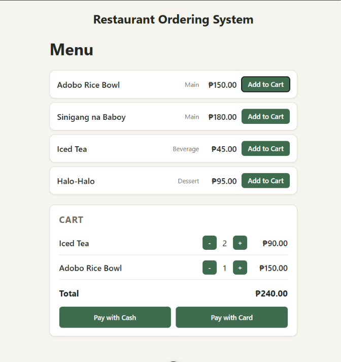

# Restaurant Order API

A full-stack restaurant ordering system: a C# / ASP.NET Core backend and a Vue 3 frontend, covering menu management and the full order lifecycle: browse the menu, build a cart, check out, and get a receipt.



## Why this project

Built to demonstrate C# / ASP.NET Core backend skills (REST API design, EF Core with a relational database, request validation, automated tests) alongside a Vue 3 frontend consuming that API end to end.

## Tech stack

**Backend**
- C# / .NET 8
- ASP.NET Core Web API (controller-based)
- Entity Framework Core + SQLite
- xUnit + EF Core InMemory for tests

**Frontend**
- Vue 3 (Composition API, `<script setup>`) + Vite
- Plain CSS with custom properties, no framework
- Talks to the API directly with `fetch`

## Features

- **Menu management** — full CRUD on menu items (name, category, price, availability). Deleting an item already used in an order retires it instead of removing order history.
- **Cart** — add items to an order, adjust or remove quantities, while the order is still open.
- **Checkout** — pay an order once, recording payment method and timestamp. A paid order can no longer be modified.
- **Receipt** — retrieve the itemized receipt for a paid order.
- Prices are snapshotted onto each order line at the time they're added, so a later menu price change never rewrites an already-placed order's total.

## Project structure

```
src/RestaurantOrderApi.Api/
  Controllers/     MenuItemsController, OrdersController
  Models/          MenuItem, Order, OrderItem, OrderStatus
  Dtos/            Request/response shapes
  Data/            RestaurantDbContext, seed data
  Migrations/      EF Core migrations
tests/RestaurantOrderApi.Tests/
  OrderTotalTests.cs        unit tests for order total calculation
  OrdersControllerTests.cs  controller tests for cart/pay/receipt rules
frontend/
  src/components/  MenuList.vue, Cart.vue, Receipt.vue
  src/App.vue      owns shared state, orchestrates checkout
  src/style.css    shared design tokens (colors, spacing)
```

## Running locally

Two processes run side by side: the API and the frontend dev server.

**1. Start the API**
```bash
cd src/RestaurantOrderApi.Api
dotnet run
```
Applies EF Core migrations automatically and seeds a starter menu. Listens on `http://localhost:5281`. Swagger UI is available at `/swagger` in development.

**2. Start the frontend** (in a separate terminal)
```bash
cd frontend
npm install
npm run dev
```
Opens at `http://localhost:5173`. The API's CORS policy is configured specifically for this origin.

## Running tests

```bash
dotnet test
```

## Building the frontend for production

```bash
cd frontend
npm run build
```

## API overview

| Method | Route | Description |
| --- | --- | --- |
| GET | `/api/menuitems` | List menu items |
| POST | `/api/menuitems` | Create a menu item |
| PUT | `/api/menuitems/{id}` | Update a menu item |
| DELETE | `/api/menuitems/{id}` | Delete or retire a menu item |
| POST | `/api/orders` | Create an order |
| POST | `/api/orders/{id}/items` | Add an item to the cart |
| DELETE | `/api/orders/{id}/items/{menuItemId}` | Remove (or reduce) an item from the cart |
| POST | `/api/orders/{id}/pay` | Pay the order |
| GET | `/api/orders/{id}/receipt` | Get the receipt for a paid order |
